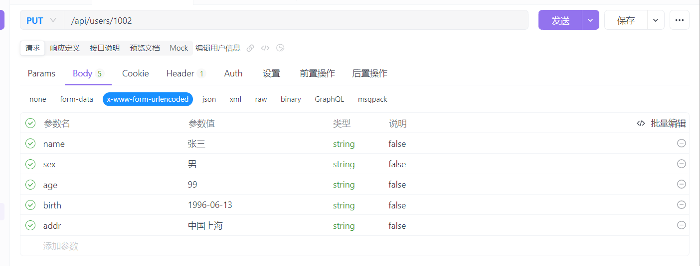
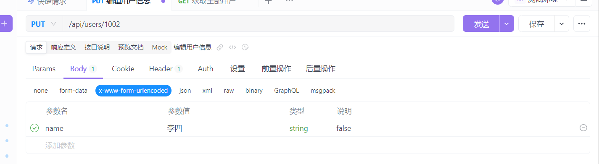

# 项目介绍

## node

- `node`遵守的是`commonJS模块化`规范

  - 每一个文件都是一个模块，都有自己的作用域

  - 在模块内部，`module`变量代表自身

  - `module.exports`提供对外接口

    ```js
    // xxx1 是外面使用的名字
    // xxx2 可以是变量名、函数名
    // 建议：尽量保持xxx1和xxx2的一致
    module.exports.xxx1 = xxx2 
    ```

- `require`语法

  - `/`绝对路径，`./`相对路径
  - 如果没写后缀，那么文件默认后缀：`js json node`；会依次查找
  - `require('http')`

- `global`全局对象

  如果在`js`中写`global.xxx`，那么`xxx`在任何地方都可以被使用。

  `./a.js`

  ```js
  const test1 = 1
  // 全局对象,这里没有window全局对象
  global.test2 = 2
  export.module.test1 = test1 
  ```

  `./b.js`

  ```js
  const mod = require('./a')
  console.log(mod.test1)
  // 不报错,可以正常使用
  console.log(mod.test2)
  ```

## npm

### npm下载包方式

```sh
npm i xxx -g # 全局安装,一般很少使用
npm i xxx -S # 局部安装,下载到生产环境 （较多）
npm i xxx -D # 局部安装,下载到开发环境 （较少）
```

### package.json

`package.json`就是项目描述的模块，项目会根据`package.json`下载库。

## node连接mysql数据库

- 下载`Mysql`包

  ```sh
  npm i mysql
  ```

- 实现

  ```js
  /**
   * @描述:连接mysql数据库
   */
  
  // 1.导入包
  const mysql = require('mysql')
  
  // 2.填写配置信息
  const connection = mysql.createConnection({
      host: 'localhost',
      user: 'root',
      password: 'root123',
      database: 'manage', // 数据库名，指定连接哪个数据库
  })
  
  // 3.建立连接
  connection.connect()
  
  // 4.查询语句
  connection.query('select * from test', (err, results, fields) => {
      if (err) { throw err };
      console.log(results);
  })
  
  // 5.关闭连接
  connection.end()
  
  ```

  

- 数据操作

  - `?`代表占位符，会由后面的变量填充

  - 如果用户的id在数据库中是自增长的,那么在`insert`语句中写`?`，后面使用`0`填充`?`，代表使用数据库的自增长规则。
  - 注意：如果在数据库中删除`id`，不会使用已删除的`id`，依旧会继续增长。

## express

- `express`基于`node.js`的web应用开发框架

- `express`项目的目录结构：

  可以使用`express`生成器工具`express-generator`快速生成项目的骨架

## 登录和注册接口

- token

  - 用户**登录**成功后,返回`Token`到客户端

    ```sh
    # 生成Token包jwt
    npm i jsonwebtoken
    ```

    ```js
    const jwt = require('jsonwebtoken')
    // 返回值是token
    // 规则:一般是用户信息如id,名字等
    // 加密名字:开发自主确定
    jwt.sign('规则','加密名字','过期时间','箭头函数')
    ```

  - 用户在后续发送请求，需要验证`Token`

    ```sh
    # 验证token的包
    npm i passport-jwt passport
    ```

    ```js
    // 以其中某个需要验证Token的请求为例
    // $router GET users
    // @desc 返回请求的json数据
    // @access private
    router.get('/users',
            // 验证token,token验证通过才会执行下一个函数
            passport.authenticate('jwt', { session: false }), 
            usersHandler.getAllUsers)
    ```

## 用户信息接口

其他的增删改查与之类似。

### `RESTful API`

- 获取所有用户：GET /users  

- 获取单个用户：GET /users/:id

- 创建用户：POST /users  

- 更新用户：PUT /users/:id

- 删除用户：DELETE /users/:id


### 获取所有用户

**注意，获取所有用户应该是按页码和条数返回的,使用数据库的`limit`语句实现**

```js
// 后段路由规则
router.get('/users',
    passport.authenticate('jwt', { session: false }),
    usersHandler.getAllUsers)
```

### 获取个用户

```js
// 后端路由规则
router.get('/users/:id',
    passport.authenticate('jwt', { session: false }),
    usersHandler.getOneUsers)
```

```js
exports.getOneUsers = (req, res) => {
    if (!req.params.id) return res.status(400).json('错误,请重新查询!')

    const sql = `select * from users where id = ?`
    db.query(sql, req.params.id, (err, results) => {
        if (err) return res.status(400).json(err)
        if (results.length === 0) return res.status(200).json('没有数据!')
        res.json(results)
    })

}
```

前端使用接口`/api/users/1001` 获取`id`为1001用户的信息

### 新增用户

```js
// 后端路由规则
router.post('/users',
    passport.authenticate('jwt', { session: false }),
    usersHandler.postUsers)
```

```js
exports.postUsers = (req, res) => {
    const fields = {}
    if (req.body.name) fields.name = req.body.name
    if (req.body.sex) fields.sex = req.body.sex
    if (req.body.age) fields.age = req.body.age
    if (req.body.birth) fields.birth = req.body.birth
    if (req.body.addr) fields.addr = req.body.addr

    const sql = `insert into users set ?`
    db.query(sql, fields, (err, results) => {
        if (err) return res.status(404).json(err)
        if (results.affectedRows !== 1) return res.status(400).json('添加失败')
        res.json({
            msg: '添加用户信息成功!'
        })
    })
}
```

### 编辑用户

```js
// 后端路由
router.put('/users/:id',
    passport.authenticate('jwt', { session: false }),
    usersHandler.putUsers)
```

```js
exports.putUsers = (req, res) => {
    // 修改的信息通过请求体传
    const fields = {}
    if (req.body.name) fields.name = req.body.name
    if (req.body.sex) fields.sex = req.body.sex
    if (req.body.age) fields.age = req.body.age
    if (req.body.birth) fields.birth = req.body.birth
    if (req.body.addr) fields.addr = req.body.addr

    const sql = `update users set ? where id = ?`
    // id在路径中req.params.id
    db.query(sql, [fields, req.params.id], (err, results) => {
        if (err) return res.status(400).json(err)
        if (results.affectedRows !== 1) return res.status(400).json('编辑失败')
        res.json(fields)
    })

}
```


使用Apifox接口测试工具，前端请求：





### 删除用户信息

```js
// 后端接口
router.delete('/users/:id',
    passport.authenticate('jwt', { session: false }),
    usersHandler.deleteUsers)
```

```js
exports.deleteUsers = (req, res) => {
    if (!req.params.id) return res.status(400).json('错误,请重新查询!')

    const sql = `delete from users where id = ?`
    db.query(sql, req.params.id, (err, results) => {
        if (err) return res.status(400).json(err)
        if (results.affectedRows !== 1) return res.status(400).json('删除失败')
        res.json('删除成功')
    })
}
```


